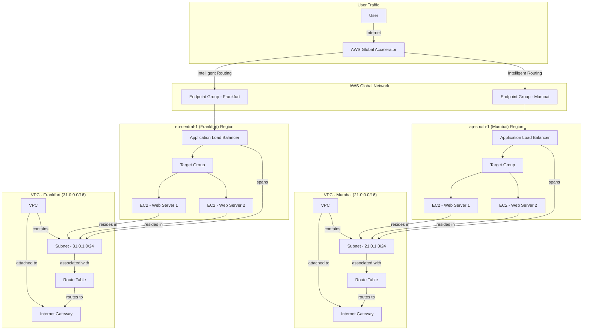

Of course. You can achieve a side-by-side layout in a GitHub `README.md` file by using HTML tables. This is a great way to keep the visual architecture diagram visible while a user reads through the implementation steps.

Here is the updated `README.md` code. Simply copy and paste this into your file. The diagram will appear on the left, and the detailed guide will be on the right.

---

# AWS Global Accelerator & Multi-Region Networking

This document outlines the steps to design and implement a highly available and low-latency global application architecture using AWS services. By leveraging AWS Global Accelerator, we can intelligently route user traffic to the nearest healthy regional endpoint, thereby improving uptime and performance.

---

<table>
<tr>
<td valign="top">

### Architecture Diagram



### Outcomes

*   **Improved Global Application Uptime:** By distributing traffic across multiple regions, the application remains available even if one region experiences an outage.
*   **Reduced Latency:** User traffic is intelligently routed to the AWS edge location closest to them, resulting in lower latency and better performance.

</td>
<td valign="top">

## Step-by-Step Implementation Guide

Here is a detailed breakdown of the steps required to configure this architecture:

### 1. VPC and Subnet Creation

First, create two Virtual Private Clouds (VPCs), one in Mumbai (`ap-south-1`) and another in Frankfurt (`eu-central-1`).

**In the Mumbai (`ap-south-1`) Region:**

1.  **Create VPC:**
    *   **Name:** `VPC-Mumbai`
    *   **CIDR block:** `21.0.0.0/16`
2.  **Create Subnet:**
    *   **VPC:** `VPC-Mumbai`
    *   **Name:** `Public-Subnet-Mumbai`
    *   **CIDR block:** `21.0.1.0/24`
3.  **Create & Attach Internet Gateway:**
    *   Create `IGW-Mumbai` and attach it to `VPC-Mumbai`.
4.  **Configure Route Table:**
    *   In the main route table for `VPC-Mumbai`, add a route:
        *   **Destination:** `0.0.0.0/0`
        *   **Target:** `IGW-Mumbai`

**In the Frankfurt (`eu-central-1`) Region:**

1.  **Create VPC:**
    *   **Name:** `VPC-Frankfurt`
    *   **CIDR block:** `31.0.0.0/16`
2.  **Create Subnet:**
    *   **VPC:** `VPC-Frankfurt`
    *   **Name:** `Public-Subnet-Frankfurt`
    *   **CIDR block:** `31.0.1.0/24`
3.  **Create & Attach Internet Gateway:**
    *   Create `IGW-Frankfurt` and attach it to `VPC-Frankfurt`.
4.  **Configure Route Table:**
    *   In the main route table for `VPC-Frankfurt`, add a route:
        *   **Destination:** `0.0.0.0/0`
        *   **Target:** `IGW-Frankfurt`

### 2. EC2 Instance and Apache Web Server Setup

Launch and configure EC2 instances in each public subnet.

**In Both Regions (Mumbai and Frankfurt):**

1.  **Launch EC2 Instances:**
    *   Choose an AMI (e.g., Amazon Linux 2).
    *   Select the respective VPC and public subnet.
    *   **Enable** Auto-assign Public IP.
2.  **Configure Security Groups:**
    *   Allow inbound traffic on port `22` (SSH) from your IP and port `80` (HTTP) from anywhere (`0.0.0.0/0`).
3.  **Install Apache:**
    *   SSH into each instance and run:
        ```bash
        sudo yum update -y
        sudo yum install -y httpd
        sudo systemctl start httpd
        sudo systemctl enable httpd
        ```
    *   Create a unique `index.html` to identify the region.

### 3. ALB and Target Group Configuration

Set up an Application Load Balancer (ALB) in each region.

**In Both Regions (Mumbai and Frankfurt):**

1.  **Create Target Group:**
    *   **Target type:** `Instances`
    *   **Protocol:** `HTTP`, **Port:** `80`
    *   Select the respective VPC.
    *   Register the EC2 instances in that region as targets.
2.  **Create Application Load Balancer:**
    *   **Scheme:** `Internet-facing`
    *   Select the respective VPC and public subnet.
    *   Attach a security group allowing inbound HTTP traffic (port 80).
    *   Forward traffic to the target group created above.

### 4. AWS Global Accelerator Configuration

Set up Global Accelerator to direct traffic to the regional ALBs.

1.  **Create Accelerator:**
    *   Navigate to the AWS Global Accelerator console and click "Create accelerator".
    *   Provide a name. Global Accelerator will give you two static IP addresses.
2.  **Add a Listener:**
    *   **Port range:** `80`, **Protocol:** `TCP`
3.  **Add Endpoint Groups:**
    *   Create one endpoint group for each region (`ap-south-1` and `eu-central-1`).
    *   For each endpoint group, add the respective Application Load Balancer as the endpoint.

</td>
</tr>
</table>